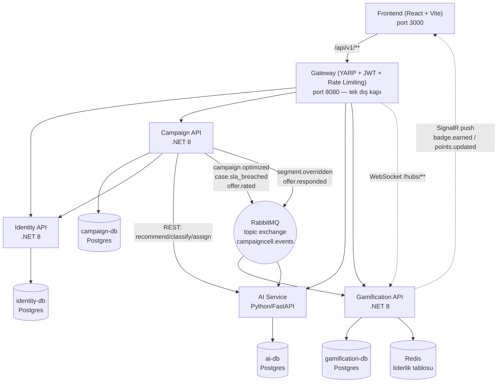

# CampaignCell

Telekom operatörleri için düşük dönüşümlü kampanyaları **otomatik tespit edip optimize eden**,
AI destekli uzman atama ve gamification ile desteklenen bir "optimizasyon vakası" platformu.
4 mikroservis (.NET 8 + Python/FastAPI), tek bir Gateway (YARP) arkasında, React frontend ile.

> Takım rolleri ve fazlı teslim planı için `Mali.md` / `Mali_Plan.md` (backend/mimari),
> proje "anayasası" için `Core_Principles.md`.

## Mimari



- **Database-per-service:** her .NET/Python servisin kendi Postgres'i var, fiziksel ayrım (FK yok, cross-service id'ler sadece referans).
- **Event-driven:** servisler arası asenkron iletişim RabbitMQ topic exchange üzerinden (`campaigncell.events`); tam katalog → [`EVENTS.md`](EVENTS.md).
- **Defense in depth:** JWT hem Gateway'de hem her downstream serviste bağımsız doğrulanır.
- **Graceful degradation:** AI servisi kapansa/timeout olsa bile kampanya akışı kesilmez (`BELIRSIZ`/`ORTA` fallback) — bkz. `docs/AI_APPROACH.md` §7.

## Servisler

| Servis | Teknoloji | README |
|---|---|---|
| Gateway | .NET 8, YARP | [`gateway/README.md`](gateway/README.md) |
| Identity | .NET 8, Clean Architecture, EF Core | [`services/identity/README.md`](services/identity/README.md) |
| Campaign | .NET 8, Clean Architecture, EF Core | [`services/campaign/README.md`](services/campaign/README.md) |
| Gamification | .NET 8, Clean Architecture, EF Core, SignalR | [`services/gamification/README.md`](services/gamification/README.md) |
| AI Service | Python 3.12, FastAPI, scikit-learn | [`services/ai/README.md`](services/ai/README.md) — yaklaşım detayı: [`docs/AI_APPROACH.md`](docs/AI_APPROACH.md) |
| Frontend | React + Vite + TypeScript | [`frontend/README.md`](frontend/README.md) |

## Kurulum (tek komut şartı)

```bash
git clone <repo-url> && cd CodeNight_AllStar
cp .env.example .env          # gerekirse sirlari duzenle (dev varsayilanlari calisir haldedir)
docker compose up --build -d  # migration + seed otomatik calisir
```

Tüm servisler `GET /health` sunar; `docker compose ps` ile hepsinin `healthy` olduğunu doğrula.
Frontend: **http://localhost:3000** — API her zaman tek kapıdan: **http://localhost:8080/api/v1/...**

RabbitMQ yönetim arayüzü: http://localhost:15672 (kullanıcı/şifre `.env`'deki `RABBITMQ_USER`/`RABBITMQ_PASSWORD`).

### API dokümantasyonu (Swagger / OpenAPI)

Development ortamında (varsayılan `.env`) her .NET servisin kendi `/swagger` sayfası vardır
(gateway'i atlayıp doğrudan servis portundan, bkz. Core_Principles §9 debug portları):

- Identity: http://localhost:5001/swagger
- Campaign: http://localhost:5002/swagger
- Gamification: http://localhost:5004/swagger
- AI Service (FastAPI): http://localhost:5003/docs

Swagger'daki "Authorize" ile `POST /api/v1/auth/login`'den alınan `accessToken`'ı
`Bearer <token>` formatında girip korumalı endpoint'leri deneyebilirsin.

## Demo kullanıcıları

Seed otomatik çalışır (`docs/SEED_DATA.md`'ye birebir), `docker compose up`'tan hemen sonra kullanılabilir:

| Rol | E-posta | Şifre |
|---|---|---|
| ADMIN | `admin@campaigncell.com` | `Admin.2026!` |
| SUPERVIZOR | `supervizor@campaigncell.com` | `Super.2026!` |
| PERSONEL (uzman) | `deniz.karaca@campaigncell.com`, `merve.aksoy@campaigncell.com`, `kaan.erdem@campaigncell.com`, `ece.yildiz@campaigncell.com` | `Uzman.2026!` |
| MUSTERI | 10 seed abone (OTP akışı) | OTP: `1234` |

## Portlar

| Container | İç Port | Host Port |
|---|---|---|
| gateway | 8080 | **8080** (tek dış kapı) |
| frontend | 80 | 3000 |
| identity-api / campaign-api / ai-api / gamification-api | 8080 / 8080 / 8000 / 8080 | 5001 / 5002 / 5003 / 5004 (debug/Swagger için) |
| identity-db / campaign-db / ai-db / gamification-db | 5432 | 5433 / 5434 / 5435 / 5436 |
| rabbitmq | 5672 | 5672, 15672 (yönetim UI) |
| redis | 6379 | 6379 |

Frontend **sadece** Gateway üzerinden konuşur; servis portlarına doğrudan istek atmak (debug/Swagger dışında) sözleşme dışıdır.

## Güvenlik

Core_Principles §10 kontrol listesinin tamamı canlı test edildi (Faz 8): SQL injection,
XSS, IDOR, JWT doğrulama (bozuk/kurcalanmış/süresi dolmuş → 401), rol ihlali (403 + audit
log), refresh token rotation + hırsızlık koruması (çalınmış token tekrar kullanılırsa TÜM
oturumlar kapatılır), rate limiting (60/dk global, 5/dk login), hesap kilitleme (5 yanlış
deneme → 15 dk, kalan süre response'ta), bcrypt (work factor 11) + kural bazlı şifre
politikası mesajları, secrets yönetimi (`.env`, koda gömme yok).

## Test + CI

- Her .NET servisin kendi xUnit test projesi var (`tests/*.UnitTests`): state machine geçiş
  matrisi, refresh token rotation/theft, şifre politikası, atama skor formülü, puan/badge
  kuralları, en az 1 gerçek EF Core + MediatR entegrasyon testi (`Campaign.UnitTests/Integration`).
- AI servisi: `pytest` (`services/ai/tests`).
- `.github/workflows/ci.yml`: her push/PR'da paralel olarak dotnet build+test (Identity/
  Campaign/Gamification matrix), gateway build, AI pytest, frontend build çalışır.

Yerel çalıştırma:

```bash
# .NET (her servis kendi solution'ı)
dotnet test services/identity/Identity.sln
dotnet test services/campaign/Campaign.sln
dotnet test services/gamification/Gamification.sln

# AI
cd services/ai && pip install -r requirements-dev.txt && pytest

# Frontend
cd frontend && npm ci && npm run build
```

## Dokümantasyon haritası

| Dosya | İçerik |
|---|---|
| `Core_Principles.md` | Proje "anayasası" — mimari kurallar, sözleşmeler, güvenlik listesi, event kataloğu kaynağı |
| `EVENTS.md` | Event kataloğu (RabbitMQ + SignalR) — payload alanları, tüketiciler |
| `docs/AI_APPROACH.md` | AI yaklaşımı, model eğitimi, doğruluk takibi, graceful degradation |
| `docs/SEED_DATA.md` | Demo veri seti (kullanıcılar, abone profilleri) |
| `Mali.md` / `Mali_Plan.md` | Backend/mimari sorumluluğu — fazlı görev listesi |
